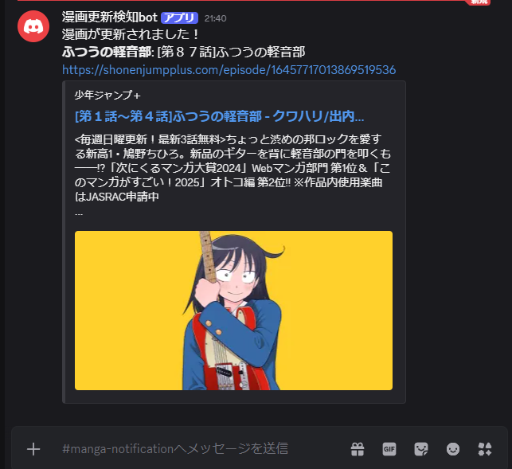

# 漫画更新検知ツール

[](https://github.com/ose20/manga-update-notifier/actions/workflows/ci.yml)

登録したWeb漫画の更新状況をチェックし、更新されていれば適当な通知チャネルに報告をするツール。

## 利用方法(for users)
### 必要なツール
以下のツールがインストールされていることを前提とする。

#### **Rust**
- 概要
  - 本プログラムがRustで書かれており、それをコンパイル&実行する必要があるため
- インストール方法
  - [公式で案内されている方法](https://rust-lang.org/tools/install/)などを用いてインストールする（一瞬&簡単）

#### **cargo-make**
- 概要
  - 本ツールのタスクランナーとして利用している
  - コンテナの管理、2つのバイナリモードの実行、環境変数の設定、各種タスク間の依存関係の整理などを主にやっている
  - [公式へのリンク](https://github.com/sagiegurari/cargo-make)
- インストール方法
  ```sh
  cargo install cargo-make
  ```

#### **Docker**
- 概要
  - 検知対象の漫画情報を永続化するRDB(PostgresSQL)やWebクロールに使うSeleniumなどのミドルウェアはDocker Composeで管理する
    - そのため、`docker compose`コマンドが使える環境を想定する
  - PostgreSQL、Seleniumの直接のインストールは不要
- インストール方法
  - [公式リンク](https://docs.docker.com/compose/install/)から自身の環境に合わせて利用する

### 必要なファイル
本リポジトリのプロジェクトルートに以下の内容の`secret.env`というファイルを作成する
```sh
DISCORD_BOT_TOKEN="${利用者のDiscordのBotトークン}"
DISCORD_CHANNEL_ID="${最新話の更新に使うチャンネルのID}"
DISCORD_ERR_CHANNEL_ID="${エラーの送信に使うチャンネルのID}"
```
ここで必要な情報の取得方法は次節で解説する。

### Discord Botと通知先チャンネル
本ツールでは通知にDiscordを使っているので、その通知を担うDiscord Botと、それが通知に使うチャンネルが必要になる。
- Discord Botの作成とTokenの取得
  - [公式ドキュメント](https://discord.com/developers/docs/tutorials/hosting-on-cloudflare-workers#adding-bot-permissions)の`Creating an app on Discord`のセクションを参考に、Discordのアプリケーションアカウント(bot)を作成する
  - 作成したアカウントのダッシュボードからBotトークンを取得する
    - 本ドキュメント作成時は、ダッシュボードの左側のペイン > Bot > Tokenで到達可能
- 通知に使いたいチャンネルを作成し、先ほど作成したBotを招待する
  - エラー用チャンネルを分けたい場合は同様に作成しBotを招待する
- 上記チャンネルのIDを取得する
  - 方法自体は単純なので適宜やり方を調べる

以上の手順により、前節のファイル作成に必要な3つのデータが取得できた。

### 実行方法
#### サーバーモード
追跡対象の漫画情報の作成、編集、削除ができるAPIサーバーを立ち上げるモードは次のコマンドで実行する。
```sh
cargo make run-server
```

#### バッチモード
DBに登録された漫画の更新状況を調べて、更新があったら通知をするワンショットのプログラムを実行する。
```sh
cargo make run-notifier
```

## 使用例
1. サーバーモードで起動
```sh
# 実行例
$ cargo make run-server
[cargo-make] INFO - cargo make 0.37.21
[cargo-make] INFO - Calling cargo metadata to extract project info
[cargo-make] INFO - Cargo metadata done
[cargo-make] INFO - Build File: Makefile.toml
[cargo-make] INFO - Task: run-server
[cargo-make] INFO - Profile: development
[cargo-make] INFO - Execute Command: "docker" "compose" "--profile" "selenium" "down"
[+] Running 6/6
 ✔ Container selenium2                         Removed                                                             5.4s
 ✔ Container selenium1                         Removed                                                             5.1s
 ✔ Container selenium0                         Removed                                                             5.6s
 ✔ Container manga-update-notifier-postgres-1  Removed                                                             0.0s
 ✔ Container selenium3                         Removed                                                             4.8s
 ✔ Network manga-update-notifier_default       Removed                                                             0.4s
[cargo-make] INFO - Execute Command: "docker" "compose" "up" "-d"
[+] Running 2/2
 ✔ Network manga-update-notifier_default       Created                                                             0.0s
 ✔ Container manga-update-notifier-postgres-1  Started                                                             0.3s
[cargo-make] INFO - Running Task: migrate
[cargo-make] INFO - Execute Command: "/bin/bash" "/tmp/fsio_K9XzMCOzUN.sh"
[cargo-make] INFO - Execute Command: "docker" "compose" "--profile" "selenium" "up" "-d" "--wait"
[+] Running 5/5
 ✔ Container selenium2                         Healthy                                                             6.1s
 ✔ Container selenium3                         Healthy                                                             6.1s
 ✔ Container selenium0                         Healthy                                                             6.1s
 ✔ Container manga-update-notifier-postgres-1  Healthy                                                             4.6s
 ✔ Container selenium1                         Healthy                                                             6.1s
[cargo-make] INFO - Execute Command: "cargo" "run" "--release" "-p" "server"
    Finished `release` profile [optimized] target(s) in 0.42s
     Running `target/release/server`
2025-11-23T20:04:33.044077829+09:00  INFO server/src/main.rs:24: Server listening on 127.0.0.1:8000
```

2. 追加したい漫画情報を追加
```sh
# 実行例
$ curl -v -X POST "http://localhost:8000/mangas" \
  -H "Content-Type: application/json" \
  -d @- << 'EOF'
{
  "title": "ふつうの軽音部",
  "shortTitle": "normal_keionbu",
  "publicUrl": "https://shonenjumpplus.com/episode/16457717013869519536",
  "crawlUrl": "https://shonenjumpplus.com/rss/series/14079602755590623793",
  "portalKind": "JumpPlus"
}
EOF
Note: Unnecessary use of -X or --request, POST is already inferred.
*   Trying 127.0.0.1:8000...
* Connected to localhost (127.0.0.1) port 8000 (#0)
> POST /mangas HTTP/1.1
> Host: localhost:8000
> User-Agent: curl/7.81.0
> Accept: */*
> Content-Type: application/json
> Content-Length: 244
>
* Mark bundle as not supporting multiuse
< HTTP/1.1 201 Created
< content-length: 0
< date: Sun, 23 Nov 2025 11:09:53 GMT
<
* Connection #0 to host localhost left intact
```

**補足**
- 漫画情報の登録に必要なものは以下の通り
  - title
    - 漫画のタイトル
    - 自由に決めていい
  - short_title
    - 漫画の短縮タイトル
    - 他の漫画のshort_titleと被らなければ自由に決めていい
  - publicUrl
    - 通知するときに使うURL
    - システム的には自由に決めていいがユーザーが漫画を見るときにふさわしいURLが設定されていると望ましい
  - crawlUrl
    - 最新話情報を取得するときに使うURL
    - これを間違えると話数が取得できない
    - 指定の仕方は後述のportalKindの値に依存する(ように実装されている)
      - RSSが提供されているタイプのポータルサイトはそのページのURL
      - RSSが指定されていない場合はその漫画の話一覧が表示されているページのURL
        - ただし最新順と古い順(一話)からの表示オプションがある場合は、前者のページのURL
    - 例
      - ふつうの軽音部掲載ポータルである少年ジャンププラスはRSSを提供しているので、そのページである`https://shonenjumpplus.com/rss/series/14079602755590623793`
  - portalKind
    - その漫画が掲載されているポータルサイトを一意に特定する文字列
    - ドメインモデル`PortalKind`の[生成規則(FromStrトレイト実装)](./domain/src/manga/portal/portal_kind.rs)に候補がある
    - 例
      - ふつうの軽音部が掲載されているポータルサイトは「少年ジャンププラス」でそれを表す文字列は`JumpPlus`
    

3. サーバーモードを終了する
`Ctrl + C`などで終了する

4. バッチモードを実行する
```sh
# 実行例
> cargo make run-notifier
[cargo-make] INFO - cargo make 0.37.21
[cargo-make] INFO - Calling cargo metadata to extract project info
[cargo-make] INFO - Cargo metadata done
[cargo-make] INFO - Build File: Makefile.toml
[cargo-make] INFO - Task: run-notifier
[cargo-make] INFO - Profile: development
[cargo-make] INFO - Execute Command: "docker" "compose" "--profile" "selenium" "down"
[+] Running 6/6
 ✔ Container selenium1                         Removed                                                             4.8s
 ✔ Container selenium3                         Removed                                                             4.6s
 ✔ Container selenium2                         Removed                                                             5.5s
 ✔ Container manga-update-notifier-postgres-1  Removed                                                             0.3s
 ✔ Container selenium0                         Removed                                                             5.0s
 ✔ Network manga-update-notifier_default       Removed                                                             0.4s
[cargo-make] INFO - Execute Command: "docker" "compose" "up" "-d"
[+] Running 2/2
 ✔ Network manga-update-notifier_default       Created                                                             0.0s
 ✔ Container manga-update-notifier-postgres-1  Started                                                             0.3s
[cargo-make] INFO - Running Task: migrate
[cargo-make] INFO - Execute Command: "/bin/bash" "/tmp/fsio_zHyYUe6iTh.sh"
[cargo-make] INFO - Execute Command: "docker" "compose" "--profile" "selenium" "up" "-d" "--wait"
[+] Running 5/5
 ✔ Container selenium2                         Healthy                                                             6.1s
 ✔ Container selenium3                         Healthy                                                             6.1s
 ✔ Container selenium1                         Healthy                                                             6.1s
 ✔ Container selenium0                         Healthy                                                             5.6s
 ✔ Container manga-update-notifier-postgres-1  Healthy                                                             4.6s
[cargo-make] INFO - Execute Command: "cargo" "run" "--release" "-p" "batch"
    Finished `release` profile [optimized] target(s) in 0.12s
     Running `target/release/notifier`
2025-11-23T21:40:30.903357768+09:00  INFO batch/src/main.rs:19: App registry initialized
2025-11-23T21:40:30.909837669+09:00  INFO batch/src/main.rs:22: Found 27 mangas to check for updates
2025-11-23T21:40:30.909874700+09:00  INFO batch/src/main.rs:47: Starting check and notify tasks for all mangas
[cargo-make] INFO - Build Done in 23.71 seconds.
```

最新話が更新されると通知が来る(登録したばかりの漫画は最初は更新扱いになる)


## 未整備


### memo
- dbのpostgresもdockerで立てる
- volumeを作ったので、containerが削除されてもデータが消えることはない
    - 消えるのはdocker desktopを消したときかな？
    - なので低頻度でsql dumpみたいなのをしてバックアップファイルを取っておくのがよさそう
- rust-book-managerだとbin/app.rsでpoolの取得をしていたけど、これはregistryに任せていい気がする
    - appConfigはapp全体の設定なのでapp.rsで取る必要性はわかる


### sqlx
- cargo make migrate
  - sqlx-cli のサブコマンド migrate を使ってマイグレーションファイルを使って、データベースにスキーマ情報などを登録している
- sqlx migrate add -r start --source adapter/migrations


## Todo
- registryの調整
  - 起動するバイナリによって必要な要素が違うことの反映
    - 特に server 起動するときに chromedriver を起動したくない
- ↑の問題を解決する前にselenium container消えない問題の原因究明
  - run-hoge したあとに compose-down しても selenium が消えず、docker rm -f しないといけないのはなぜ
    - 上の問題解決しちゃっても大丈夫かも
      - だめだ
        - run-notifier2連続は大丈夫だけどrun-server -> run-notifierだと registry が作れない
          - もしかして greceful shutdown してないから説ある？
        - run-notifier後でもcompose-downで消えないけど、そのあとrun-notifierしても別に困らない
          - run-notifier -> run-serverはいけるので、やっぱりgraceful shutdownしてないからかも
- webdriverが起動しきる前にやってる
2025-11-08T21:51:12.758363633+09:00 ERROR batch/src/main.rs:10: Application error: The WebDriver request returned an error: error sending request for url (http://localhost:4444/session)
  - healthcheck設定してるけどうまくいってないっぽい
- 最適化
  - rssを提供しているサイトはwebdriver使わないのでpoolから拝借しないようにできるとうれしい
- rssタイプ
  - 最新話をクロールする場所と、実際に最新話が乗っている場所が違う
- テストさぼってるのでかく
- 実際のcrawlのテストをする環境の整備