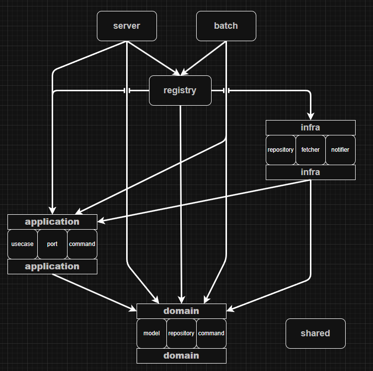

# What's this
本ツール全体の設計に関するドキュメント

# 全体像の概観
本ツールは3つのコンポーネントからなる
- PostgreSQL(ローカルで起動するDockerコンテナ)
  - 更新情報を追跡したい漫画や現在の最新話情報などを永続化する
- Selenium(ローカルで起動するDockerコンテナ)
  - Webブラウザ操作ツール
  - RSSを提供していない(単純なHTTPリクエストで情報が取得できない)サイトに対して使う
- **Rust**による漫画情報管理APIサーバー、更新検知バッチアプリ部分
  - サーバーモード、バッチモードの2つから選んで起動する

# データ永続化方針
- Dockerの名前付きボリュームとして、これを実行するコンピュータ上にデータを保存する
  - 対抗案
    - 様々なホストからアクセスできる常時起動のDBを用意する
    - フルマネージドサービスを利用する
  - 利点
    - 無料
    - 設定手順が完結
  - 欠点
    - 同一のマシン内でしか永続化情報を共有できない
      - 別のマシンで実行すると、そのマシンの永続化状況に応じて最新話更新判定がされる
    - このツール全体といてステートフルな性質を持ってしまう
      - ステートフル要因のDBだけを切り出せばツールはどこからでも実行できるようになるのに...
- 今回の意思決定の理由
  - 利点を重く評価
    - ずっと使うのでお金かからない方がいい

# Rust作成部分の設計
## アーキテクチャ概観
- オニオンアーキテクチャによるドメイン駆動設計
- 各レイヤーとその間の関係は下図参照
  - 依存している(参照している)方向に向かって矢印が向いている
    - 矢印は必ず上から下に向かうように配置されている
  - `shared`はどこからでも参照できる便利レイヤーで、矢印は省略している
- application、domain、infraはその重要性を加味して主な構成要素も記載している

## アーキテクチャ詳細
### 各レイヤーの責務
- domain層
  - ドメインモデルを扱う
  - 集約は漫画漫画だけ
  - ドメイン知識
    - 漫画の最新話情報取得ロジックはその漫画が掲載されているポータルサイトに依存する
    - ポータルサイトによってはRSSが提供されており、この手のサイトはクロールに使うurlとユーザーに通知するurlが異なる
- application層
  - ユースケース及びそれが必要とする外界とのI/Fを定義する
- infra層
  - domain/repository、application/portモジュールに定義されている外界とのデータやり取りのI/Fを実装しているクラス
  - このプロジェクトで利用している外界とのI/Fは3つのみ
    - repository
      - 漫画集約の永続化のためのI/F
    - fetcher
      - Webサイトから漫画の最新エピソードを取得するためのI/F
    - notifier
      - 通知チャネルに最新話更新検知の通知を送るためのI/F
- registry層
  - DIコンテナ作成の役割を負う
  - 少なくとも現状では、DIコンテナが必要になるのは次のケース
    - インターフェース(trait)を挟むことによって依存の向きを逆転させるとき
    - このときにインターフェースとその実装の対応付けをするのがDIコンテナ
      - そのためregistryはその両方に依存しないといけない
        - このプロジェクトでこれを用いている個所
          - application/portとその実装のinfra
            - ユースケースによって要請される外界とのI/F
          - domain/repositoryとその実装のinfra
            - ドメインモデルによって要請される外界とのI/F
        - したがってregistryはapplication,domain,infraに依存している
- server層
  - サーバーモードとして起動するときのエンドポイント
  - いわゆるUI層、presentation層と思ってよい
- batch層
  - バッチモードとして起動するときのエンドポイント
  - 下部モジュールのオーケストレーションにより以下を達成
    - 登録している漫画の最新話情報を取得しに行き
    - 更新があったらユーザーに通知してDB更新
- shared層
  - このプロジェクト全体で使うプログラムを置く
  - できるだけ小さい方がいい
    - レイヤーへの責務割り振りをさぼるとここが大きくなるため

# CI/CD
利用してる道具視点で記述する
- docker compose
- cargo make
- github actions

# Appendix
- ChatGPTへの設計相談(最初の頭出し)
  - https://chatgpt.com/share/6906353c-a174-800e-841e-70c2903fa485